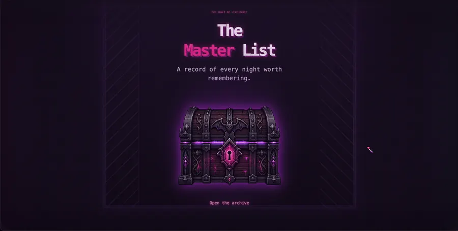
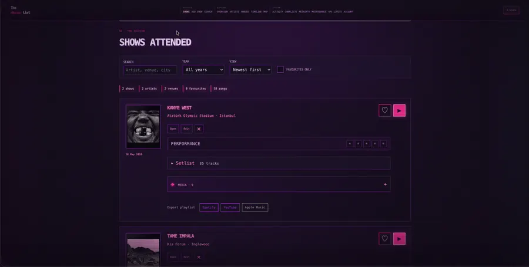
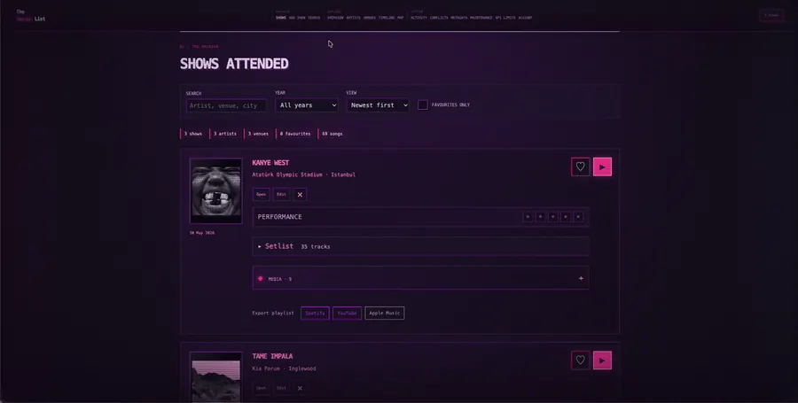
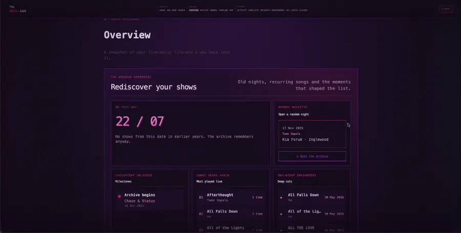
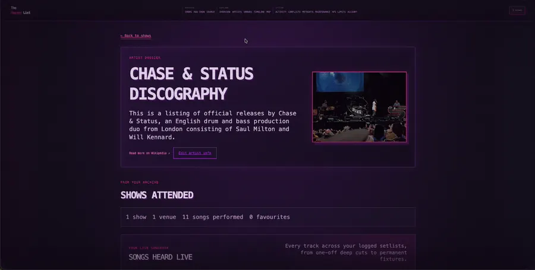
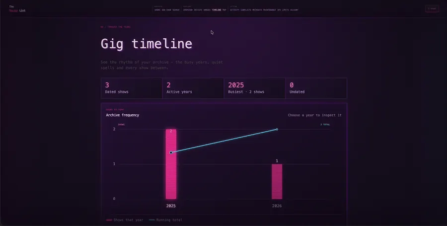
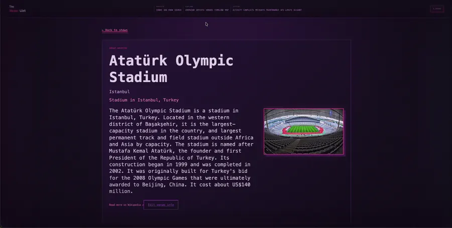
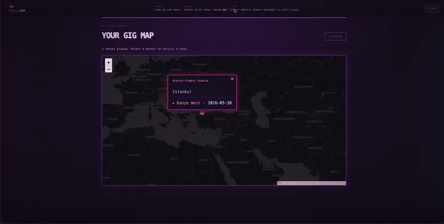

# The Master List

<p align="center">
  
</p>

A self-hosted archive for live shows, setlists, photos, videos, ratings and shared gig memories.

The Master List can find setlists through setlist.fm, export them as playlists, build whole-show playback from uploaded or YouTube media, map attended venues, and sync shared shows between trusted instances. Each installation belongs to one owner; collaboration happens by pairing separate installations.

## Features

- Record attended shows, memories, ratings and favourites.
- Fetch and edit setlists, album metadata, artists and venues.
- Upload photos, large videos and artifact images such as merch or paper setlists.
- Build editable whole-set playback with chapters, fallbacks and theatre mode.
- Export setlists to Spotify, YouTube and Apple Music.
- Explore artists, venues, maps, timelines and archive statistics.
- Pair trusted self-hosted instances and resolve simultaneous edits.
- Schedule SQLite backups and inspect archive health from the app.

## Tour

The captures use demonstration data. Open a section to see that part of the application in motion.

<details open>
<summary><strong>Home</strong> — unlock the archive through its pixel-art chest</summary>

<p align="center"></p>
</details>

<details>
<summary><strong>Shows and adding a show</strong> — browse the archive, find a setlist and record a memory</summary>

<p align="center"></p>
</details>

<details>
<summary><strong>Overview</strong> — see archive totals, favourites and listening patterns</summary>

<p align="center"></p>
</details>

<details>
<summary><strong>Artists</strong> — explore artist history, metadata and attended shows</summary>

<p align="center"></p>
</details>

<details>
<summary><strong>Venues</strong> — revisit venues and their show history</summary>

<p align="center"></p>
</details>

<details>
<summary><strong>Map</strong> — plot attended venues around the world</summary>

<p align="center"></p>
</details>

<details>
<summary><strong>Timeline</strong> — follow how the archive has grown over the years</summary>

<p align="center"></p>
</details>

<details>
<summary><strong>System tools</strong> — activity, metadata health, backups, API limits and account settings</summary>

<p align="center"></p>
</details>

## Quick start with Docker

Docker is the recommended way to run the complete stack. It includes Node.js, FFmpeg and the CPU background-removal worker.

1. Copy the configuration template:

   ```sh
   cp .env.example .env
   ```

2. Generate the two production secrets:

   ```sh
   openssl rand -hex 32
   openssl rand -base64 32
   ```

3. Open `.env` and paste the first value into `OWNER_SETUP_TOKEN` and the second into `CONNECTIONS_ENCRYPTION_KEY`.

4. Start the application:

   ```sh
   docker compose up -d --build
   docker compose ps
   ```

5. Open [http://127.0.0.1:3000](http://127.0.0.1:3000), create the owner account, and enter `OWNER_SETUP_TOKEN` when prompted. After the account exists, the setup token can be removed from `.env`; keep the encryption key permanently.

Application state lives in `./data`. Do not commit or publicly share `.env`, `data`, backups, pairing invitations or the encryption key.

For a native Node installation, LAN access, upgrades and the first-show walkthrough, see [Getting started](docs/GETTING_STARTED.md).

## Documentation

| Guide | Use it for |
| --- | --- |
| [Getting started](docs/GETTING_STARTED.md) | Docker, native installation, first login, first show and upgrades |
| [Configuration](docs/CONFIGURATION.md) | Every environment variable and deployment setting |
| [Integrations](docs/INTEGRATIONS.md) | setlist.fm, Spotify, YouTube, Apple Music, AudD and metadata providers |
| [Data and backups](docs/DATA_AND_BACKUPS.md) | Storage layout, backup scope, restore and OAuth encryption |
| [Peer collaboration](docs/PEER_COLLABORATION.md) | Pairing instances, shared shows, conflicts and trust boundaries |
| [Privacy](docs/PRIVACY.md) | Local data and information sent to optional external services |
| [Troubleshooting](docs/TROUBLESHOOTING.md) | Common startup, OAuth, media and network problems |
| [Architecture](ARCHITECTURE.md) | Module boundaries and testing strategy |
| [Contributing](CONTRIBUTING.md) | Development setup, tests and pull-request expectations |
| [Security policy](SECURITY.md) | Safe deployment and vulnerability reporting |

## Safe deployment

The default Docker binding is `127.0.0.1:3000`, so the app is not exposed to the LAN. For phone access, use a trusted LAN or private VPN and follow the exact `APP_ORIGIN` instructions in [Getting started](docs/GETTING_STARTED.md). For internet access, use an HTTPS reverse proxy, secure cookies and preferably a VPN or additional access-control layer. Never forward port 3000 directly from a router.

OAuth credentials are encrypted with AES-256-GCM when `CONNECTIONS_ENCRYPTION_KEY` is configured, and that key is mandatory in production. Encryption protects a copied data volume, but it cannot protect secrets from an attacker who controls the running server.

## Development

Node.js 24 is recommended and the minimum supported version is Node.js 20.

```sh
npm ci
npm test
npm start
```

Use `npm run dev` for automatic server restarts, `npm run test:coverage` for Node's coverage report, and `npm run setup:hooks` to enable the repository’s pre-commit checks.


## Disclaimer
This project is 100% vibe coded, so if you are allergic to synthetic code generation feel free to not use it.

## Licence

Copyright © 2026 Josh Trim. The Master List is free software distributed under the [GNU General Public License version 3](LICENSE).
